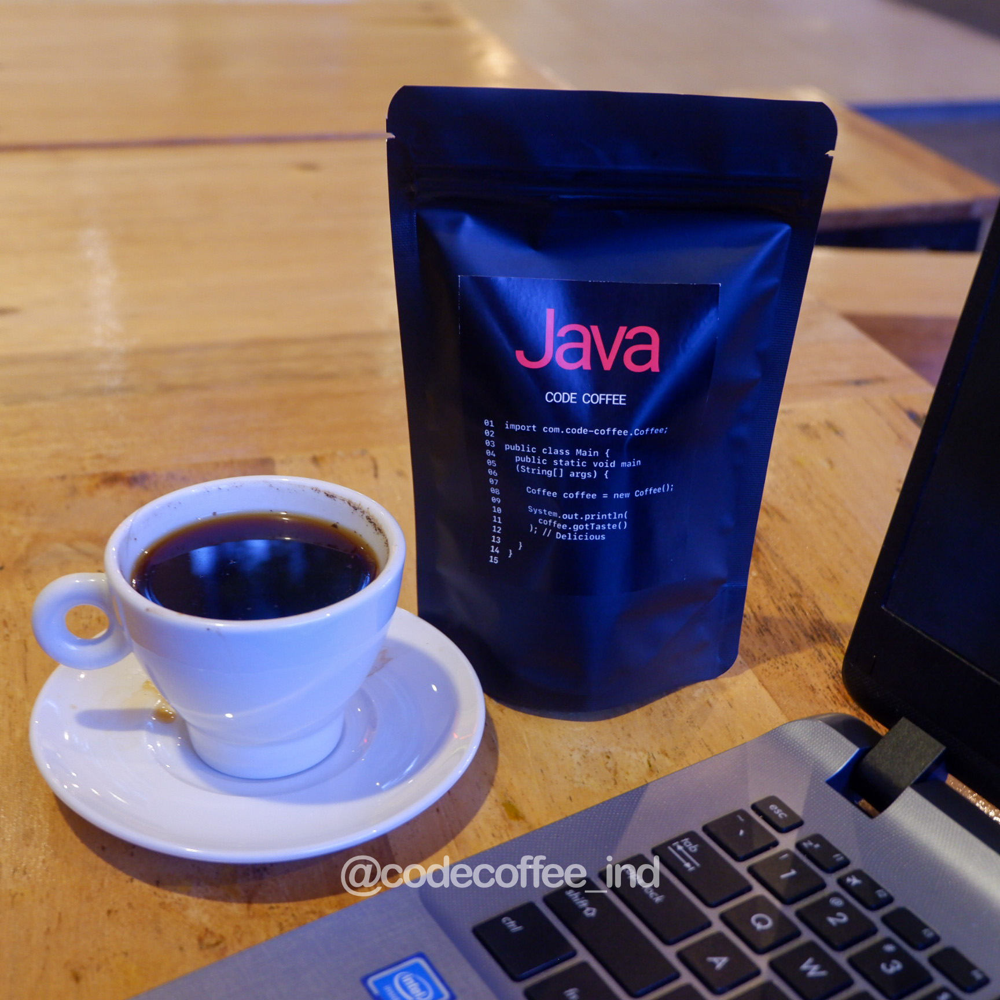

# CODE COFFEE INDONESIA V1.0 | プログラム言語のコーヒー

## KOPI DENGAN RASA BERDASARKAN BAHASA PEMROGRAMAN

Konsep yang kami bawa dari start-up Jepang ke kalian semua, kopi dengan berbagai rasa yang mampu menggambarkan ciri khas dari seluruh bahasa pemrograman ke dalam bentuk kopi yang bisa dinikmati kapan saja. Untuk Code Coffee versi 1.0 ini kami menghadirkan 6 bahasa pemrograman. Silahkan dicoba semuanya!

## COFFEE

### Java: Bahasa pemrograman primitif

Java sendiri memiliki lambang "kopi". Bahasa pemrograman tua ini ibarat kopi merupakan kopi yang sudah lama ada dan mudah didapatkan khususnya di tanah Jawa.

- Fitur: Simple dan Khas Jawa
- Rasa: Kopi Jawa
- Harga: [Rp 15.000 / 100g](https://instagram.com/codecoffee_ind)

### Ruby: Bahasa pemrograman dari Jepang

Ruby merupakan bahasa pemrograman yang berasal dari Negeri Sakura. Salah satu buah yang terkenal di Jepang adalah buah strawberry. Kami mencoba menggabungkan rasa strawberry dengan kopi lokal Indonesia.

- Fitur: Kopi dengan rasa strawberry
- Rasa: Strawberry
- Harga: [Rp 15.000 / 100g](https://instagram.com/codecoffee_ind)

### Python: Bahasa pemrograman machine learning

Python sering digunakan untuk mengembangkan Artificial Intelligence, dimana membutuhkan perangkat yang mampu cepat untuk menghitung dan memutuskan suatu permasalahan. Sebenarnya tidak ada hubungannya sama Jahe, kita pilih jahe karena Python warnanya kuning. Dah gitu aja.

- Fitur: Kopi dengan rasa jahe
- Rasa: Jahe
- Harga: [Rp 15.000 / 100g](https://instagram.com/codecoffee_ind)

### Swift: Bahasa pemrograman modern kapitalis

Swift merupakan bahasa pemrograman original dari Apple. Saat ini bahasa pemrograman ini sangat inovatif dan populer menggantikan bahasa pemrograman obj-c sebelumnya yang udah usang. Karena itulah kami mengkombinasikan Kopi terbaik kami dengan rasa Apel, sehingga terciptalah kopi inovatif terbaik kami Kopi dengan rasa Apel. Sebenarnya mau kita kapitaliskan juga untuk kopi ini, tapi nanti saja lah.

- Fitur: Kopi dengan rasa Apel
- Rasa: Apel
- Harga: [Rp 15.000 / 100g](https://instagram.com/codecoffee_ind)

### Go: Bahasa pemrograman unik

Go adalah bahasa pemrograman unik yang didevelop oleh Google. Powerful dan strict, tanpa perlu adanya dekorasi-dekorasi lain yang tidak penting. Oleh sebab itu kami memilih kopi spesial yang unik dibanding yang lain.

- Fitur: Kopi Spesial
- Rasa: Spesial
- Harga: [Rp 15.000 / 100g](https://instagram.com/codecoffee_ind)

### JavaScript: Bahasa pemrograman fleksibel

Javascript adalah bahasa pemrograman yang paling banyak digunakan dimanapun. JS, dia compatible dengan bermacam-macam bahasa pemrograman yang lain, cobalah kopi ini dengan susu!

- Fitur: Kopi Asisa
- Rasa: Asisa
- Harga: [Rp 15.000 / 100g](https://instagram.com/codecoffee_ind)
